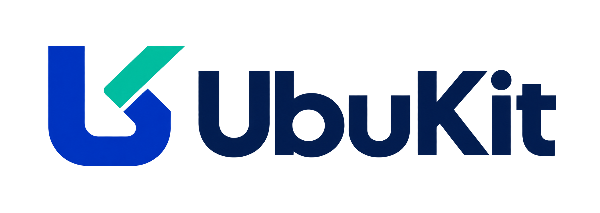

<p align="center">
  
</p>

# UbuKit

Fuzzy, rough and classical clustering, self-organizing maps, evaluation metrics
and TPE search, for Python and JavaScript.

| | |
|---|---|
| Clustering | k-means, fuzzy c-means (FCM), entropy-regularized FCM, rough c-means (RCM/ExRCM), rough membership c-means (RMCM) |
| Maps | online SOM, batch SOM, SOM with optimized latent positions (SOM-OLP) |
| Metrics | adjusted Rand index, adjusted mutual information, trustworthiness, continuity |
| Search | multivariate Tree-structured Parzen Estimator |

Both packages share names, parameters and equations ([docs/algorithms.md](docs/algorithms.md)).
Python depends only on NumPy and SciPy; JavaScript has no dependencies.

## Python

```sh
pip install ubukit
```

```python
import numpy as np
import ubukit as ub

X = np.random.default_rng(0).normal(size=(500, 2))
r = ub.fcm(X, 3, m=2.0, seed=0)
r.centers, r.membership, r.labels, r.converged

m = ub.batch_som(X, (8, 8), epochs=30)
ub.trustworthiness(X, m.embedding, k=5)

y = ub.kmeans(X, 3, seed=1).labels
best = ub.minimize(  # pick the fuzzifier whose FCM labels agree best with y
    lambda p: -ub.ari(y, ub.fcm(X, 3, m=p["m"], seed=0).labels),
    {"m": ub.uniform(1.1, 3.0)},
    n_trials=20,
)
best.best_params, best.best_value
```

## JavaScript

```sh
npm install ubukit
```

```js
import { fcm, batchSom, trustworthiness, steps, runAsync } from 'ubukit';

const X = [[0, 0], [0.1, 0.2], [4, 4], [4.2, 3.9]];   // rows, or { data, rows, cols }
const r = fcm(X, 2, { m: 2, seed: 0 });                // r.centers is { data: Float64Array, rows, cols }

// Progress and cancellation without blocking the page:
const result = await runAsync(steps.batchSom(X, [4, 4], { epochs: 30 }), {
  signal: AbortSignal.timeout(5000),
  onProgress: ({ iteration }) => console.log(iteration),
});
```

## Development

[DESIGN.md](DESIGN.md) explains what UbuKit is and why,
[CONTRIBUTING.md](CONTRIBUTING.md) how to change it, and
[CHANGELOG.md](CHANGELOG.md) what changed. Licensed under [MIT](LICENSE).
